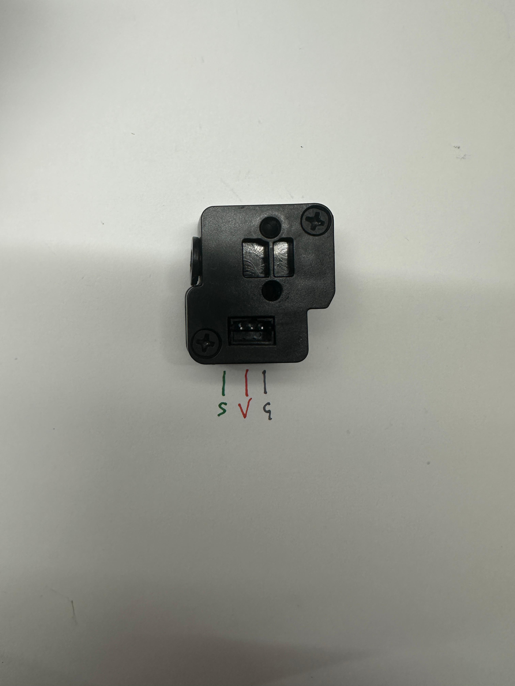

# In development


The project will aim to completely replace all the electronics, leaving the original PSU, BED and head components.
 
 Some components will be mandatory and others can be replaced with what you prefer based on your needs.

## Components:

-  [FPC Brackout 30p 1mm](https://s.click.aliexpress.com/e/_oCeUnud) Bed wiring
-  [FPC Brackout 40p 0.5mm](https://s.click.aliexpress.com/e/_oB8gCY1) LCD Wiring (Coming soon)
-  [Hall effect A3144E](https://s.click.aliexpress.com/e/_oCG6PCH) Endstop X/Y
-  [Biqu EBB36 without MAX31865 v1.2](https://s.click.aliexpress.com/e/_oo8DyPB) Head Board
-  [Biqu U2C v2.1](https://s.click.aliexpress.com/e/_oo8DyPB) CAN transceiver
-  [Biqu SKR Pico v1](https://s.click.aliexpress.com/e/_omrGoLB) Main MCU
-  [Raspberry Pi 3 Model B (1Gb)](https://s.click.aliexpress.com/e/_olvGKEN) SBC CPU Core
-  [Micro SD 64gb v30](https://s.click.aliexpress.com/e/_ooCZ32p) OS Memory (32gb v30 is also fine)
-  [Self-tapping M2.6 14mm](https://s.click.aliexpress.com/e/_oBh7XHr) Fixing screws
-  [Micro Molex 2x2](https://s.click.aliexpress.com/e/_olB1evL) to adapt EBB36
-  [Cable 22awg](https://s.click.aliexpress.com/e/_oD4gPCd) any extensions
-  [JST Crimping tool](https://s.click.aliexpress.com/e/_op3xPZP)
-  PETG 50g for adapters board


## Softwares
- [Raspberry PI Imager](https://www.raspberrypi.com/software/) Make File system
- [STM32 CubeProg](https://www.st.com/en/development-tools/stm32cubeprog.html) Flashing U2C/EBB36
- [Bitvise](https://bitvise.com/download-area) SSH for communicate with the Raspberry

## Configuration

- [Install Klipper (Kiauh)](https://github.com/dw-0/kiauh)
- [CanBus](https://github.com/FaqT0tum/FlashForge_A5M_raspberry/blob/main/CanBus/canbus.md)

## Electronics

<details>
<summary>3D Printing Display</summary>


### The Head shell (Coming soon)

</details>


<details>
<summary>Filament runout</summary>




| Runout  | MCU |  
|:---:| :---:  |
| S   | Signal | 
| V   | 5V | 
| G   | Ground | 

### Example

```bash
    [filament_switch_sensor runout_sensor]
    pause_on_runout: False
    switch_pin: !gpio3
    event_delay: 1.0
    runout_gcode:
        _FILAMENT_RUNOUT_EVENT
```

</details>


<details>
<summary>Heat Bed Wiring</summary>


### Connection diagram to reuse the original FFC and adapt it to the new MCU with a FPC Breakout 30p (1mm)


### Pins 23 to 28 are used for Load cell

### UPDATE: I was able to use the load cell system as a probe but without all the cell auto-calibration system without rebooting the board.
very simply, just connect the cables like this:

| FPC  | MCU |  
|:---:| :---:  |
| GND   | GND | 
| VCC   | 5V | 
| IO-1   | endstop pin | 


In my setup I connected everything to the JST x-stop of the SKR Pico using the reverse gpio4 pin (!)

```bash
    [probe]
    pin: !gpio4
    z_offset: -0.25
    speed: 2
    lift_speed: 5
    samples: 1
```

### Pins 23 to 28 are used for Load cell

in the diagram below are shown the flashforge elettronics between Load_cell board --> FPC --> Main board. 
For future developments

| STC8G  | FPC | N32G455 | 
|:---:| :---:  | :---: | 
| 1   | IO-2   | PB3   | 
| 3   | IO-1   | PB4   |  
| 5   | M3-TX  | PC12  | 
| 6   | M3-RX  | PD2   |  


</details>

<details>
<summary>Headtool board</summary>


### For the assembly of the Head board requires a modification to the original Micro molex 2x2 90deg connector of the ebb36 with a straight one. 
### Otherwise it will hit the back of the printer


</details>

### the above entries are expandable, click on the arrows

# Social

- [Instagram](https://www.instagram.com/faq_t0tum/)
- [YouTube](https://www.youtube.com/channel/UCHJ_528ZI0BcSU-QA8kIJlg)
- [PrusaPrinter](https://www.prusaprinters.org/social/218145-faqtotum/about)

# Buy me a coffee

This project is Free so if you have the pleasure of supporting my next works I will be grateful fot the coffee.  
[PayPal](https://www.paypal.me/MattiaRusso308?locale.x=it_IT)
