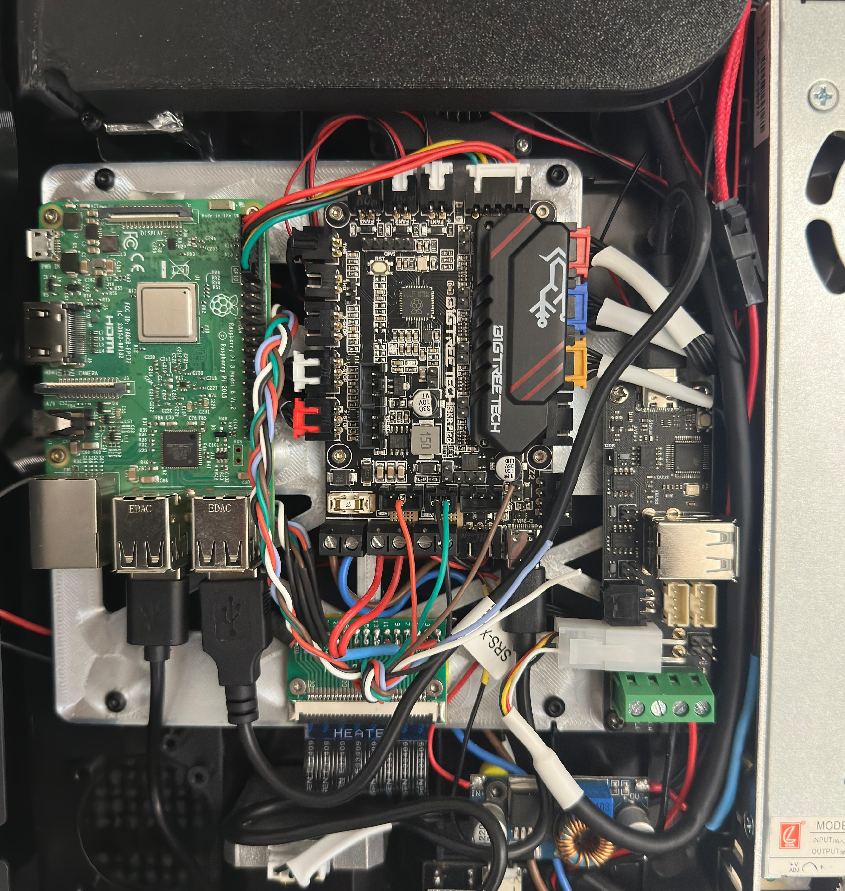
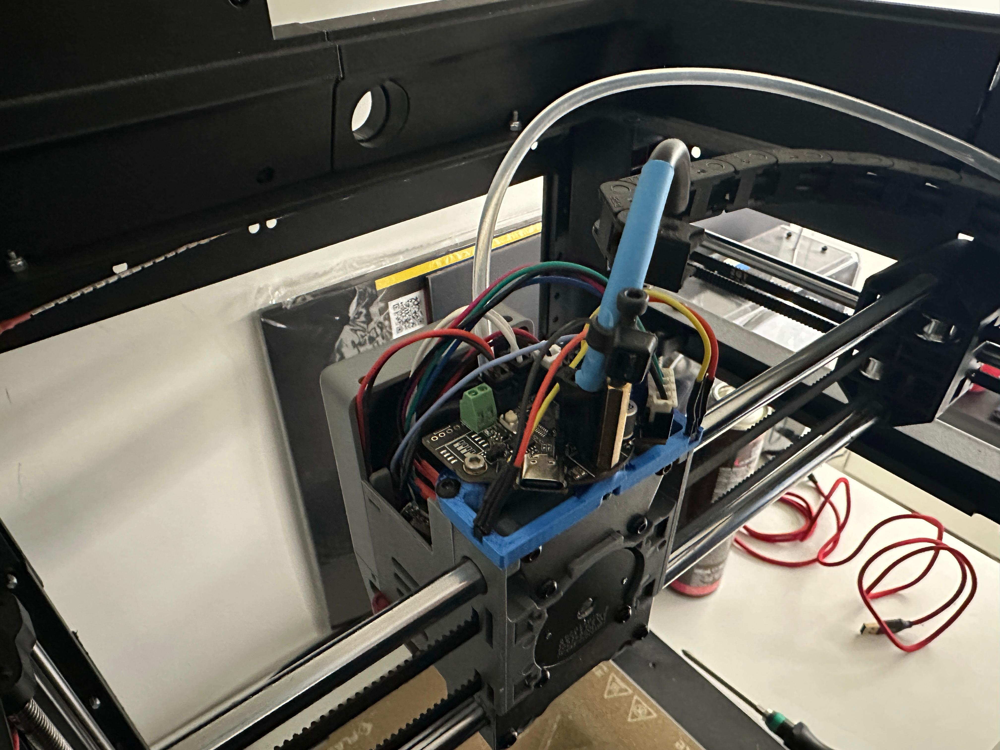

# In development

{: style="height:83px"}
{: style="height:83px"}

The project will aim to completely replace all the electronics, leaving the original PSU, BED and head components.
 
 Some components will be mandatory and others can be replaced with what you prefer based on your needs.

## Components:

-  [FPC Brackout 30p 1mm](https://s.click.aliexpress.com/e/_oCeUnud) Bed wiring
-  [FPC Brackout 40p 0.5mm](https://s.click.aliexpress.com/e/_oB8gCY1) LCD Wiring (Coming soon)
-  [Hall effect A3144E](https://s.click.aliexpress.com/e/_oCG6PCH) Endstop X/Y
-  [Biqu EBB36 without MAX31865 v1.2](https://s.click.aliexpress.com/e/_oo8DyPB) Head Board
-  [Biqu U2C v2.1](https://s.click.aliexpress.com/e/_oo8DyPB) CAN transceiver
-  [Biqu SKR Pico v1](https://s.click.aliexpress.com/e/_omrGoLB) Main MCU
-  [Raspberry Pi 3 Model B (1Gb)](https://s.click.aliexpress.com/e/_olvGKEN) SBC CPU Core
-  [Micro SD 64gb v30](https://s.click.aliexpress.com/e/_ooCZ32p) OS Memory (32gb v30 is also fine)
-  [Self-tapping M2.6 14mm](https://s.click.aliexpress.com/e/_oBh7XHr) Fixing screws
-  [Micro Molex 2x2](https://s.click.aliexpress.com/e/_olB1evL) to adapt EBB36
-  [Cable 22awg](https://s.click.aliexpress.com/e/_oD4gPCd) any extensions
-  [JST Crimping tool](https://s.click.aliexpress.com/e/_op3xPZP)
-  PETG 50g for adapters board

The rest of the components can be found in the U2C and EBB36 packages, such as JST connectors

## Softwares
- [Raspberry PI Imager](https://www.raspberrypi.com/software/) Make File system
- [STM32 CubeProg](https://www.st.com/en/development-tools/stm32cubeprog.html) Flashing U2C/EBB36
- [Bitvise](https://bitvise.com/download-area) SSH for communicate with the Raspberry

## Configuration

- [Install Klipper (Kiauh)](https://github.com/dw-0/kiauh)
- [CanBus](https://github.com/EricZimmerman/VoronTools/blob/main/EBB_CAN.md)

## Electronics

3D Printing Display

Filament runout

Heat Bed Wiring

Connection diagram to reuse the original FFC and adapt it to the new MCU with a FPC Breakout 30p (1mm)

### Pins 23 to 28 are used for Load cell but I have not yet completed the working connection configuration

now I just discovered the original connections between the board (load cell -> FFC -> Main board).
The load cell board uses the HX711 chip for strain gauges and a STC8G MCU for management and communication.
As soon as I have time I need to understand how and what to communicate with it.

| STC8G  | FPC | N32G455 | 
|:---:| :---:  | :---: | 
| 1   | IO-2   | PB3   | 
| 3   | IO-1   | PB4   |  
| 5   | M3-TX  | PC12  | 
| 6   | M3-RX  | PD2   |  

the MCU on the original board (N32G455) is a clone of the STM32F103xE

Headtool board

For the assembly of the Head board requires a modification to the original Micro molex 2x2 90deg connector of the ebb36 with a straight one. 
otherwise it will hit the back of the printer

